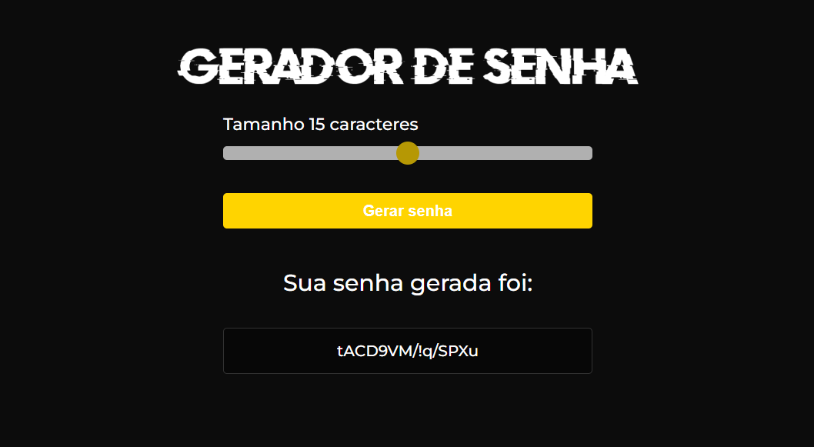

# Password generator

The idea of ​​the project was to create a password generator with the option of total characters you want. In addition to being able to practice javascript.

## 🚀 Technologies :

**Front-end:** HTML5, CSS3 and JAVASCRIPT;

## 👩‍💻 Functionalities:

- Generate password with the desired number of characters;

## 💻 How to use :

Project Link : https://project-gerador-de-senha.vercel.app/

## 👨 Author :

[@jhonathanSousa](https://www.linkedin.com/in/jhonathan-alves-sousa/)
